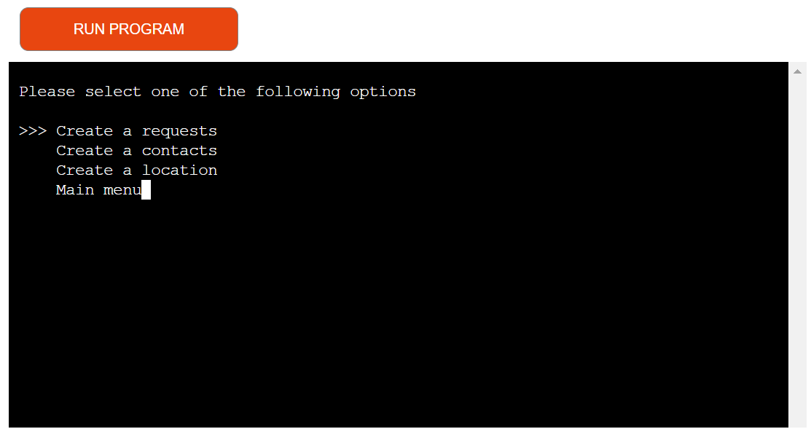
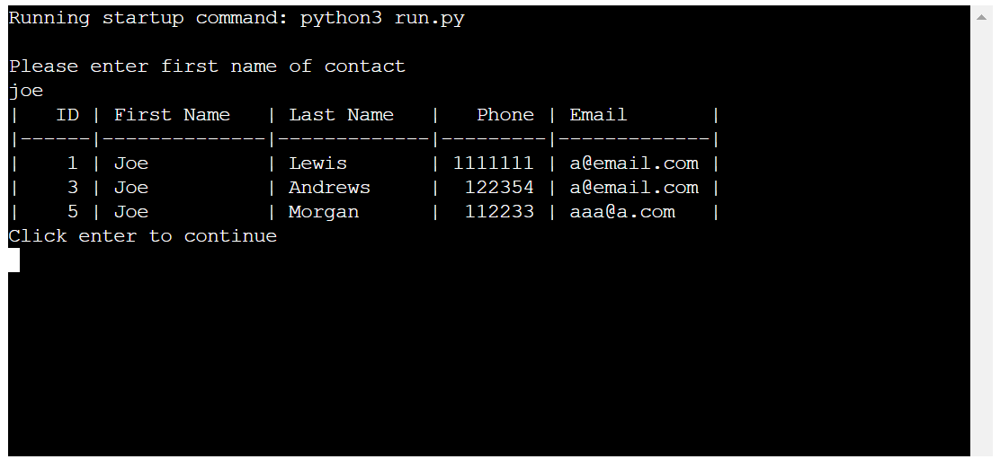
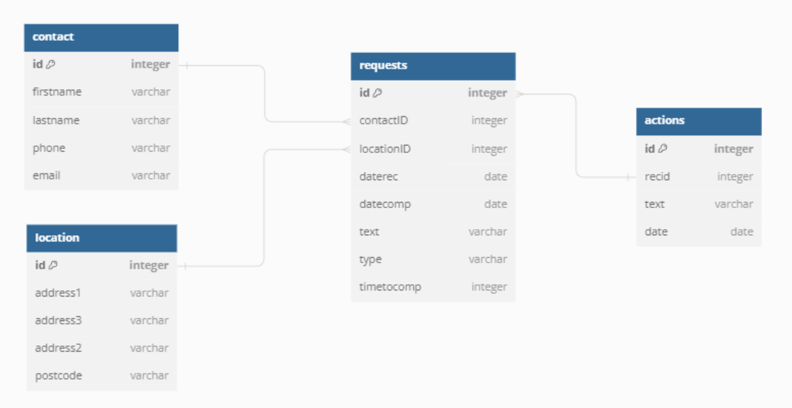

# Python Console Public Protection System

## Introduction

Welcome to my third project for my Full Stack Diploma at Code Institute.

This app is designed to support local authorities manage calls/request coming from members of public in relation to Public Protection issues. 

Visit live site: [Python Console Public Protection System](https://python-console-pp-system-0ffd3088a3de.herokuapp.com/)

## Table of Content
* [Features](#features)
    * [Start-up](#start-up)
    * [Menus](#menus)
    * [Create Records](#create-records)
    * [Search for Records](#search-for-records)
    * [Statistical Report](#statistical-report)
* [Data Model](#data-model)
* [Testing](#testing)
* [Deployment](#deployment)
* [Final Product](#final-product)
* [Credits](#credits)

## Features
[Back to table of content](#table-of-content)
### Start-up
    On start up the app welcomes the user and asked them to select a menu.

    The search menu is first as this is what most users will be wanting to select.

### Menus
    All of the menus use library called pick see credits in [Credits](#credits) section.
    
    The pick menus give the users a better user experience than compared to typing in which index they want to use.
    
    The pick menus also remove any user errors like typing in the wrong index reducing the users needing to keep trying.

### Create Records
Users can create new contacts, locations or requests/calls in this section

#### Create Request/Call
    When creating a record you need to select a contact and a location by their ID to make this easier for the user, the user can either enter the ID directly if they know it. If not the user can search for the ID instead

#### Create Contact or Location
    These functions both work on a class that then uploads to the spreadsheet this is because in future you can inherit them together to create a business and its contact on a new database 

### Search for Records
#### Search by ID
    Searching can be done by the ID of the record this will display all of the data on the record and with the requests it will also display the contact and location details its linked to

#### Search by other criteria
    You can also search by other fields in the spreadsheet it will then give you a report where you can then select on of the records by it's ID

### Statistical Report
    This lets you run a report on the average(mean) number of days it takes to close a request/call by request type

## Data Model
[Back to table of content](#table-of-content)

Please see database diagram below this was created at [https://dbdiagram.io/d](https://dbdiagram.io/d)

## Testing
[Back to table of content](#table-of-content)

## Deployment
[Back to table of content](#table-of-content)

## Final Product
[Back to table of content](#table-of-content)

## Credits
[Back to table of content](#table-of-content)