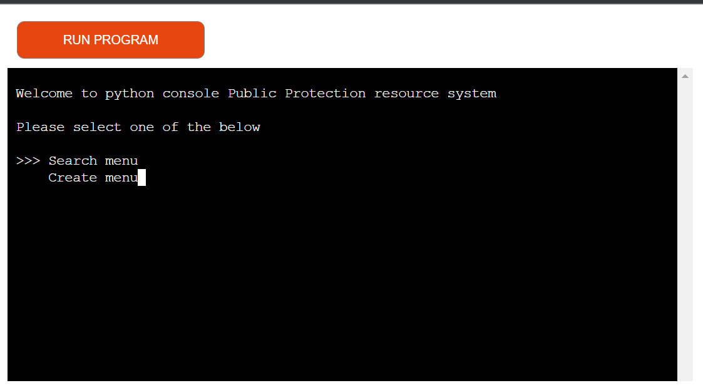
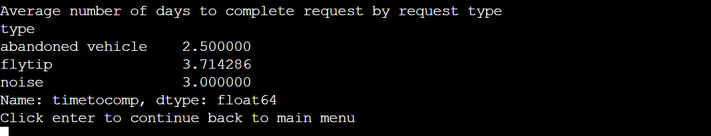

# Python Console Public Protection System

## Introduction

Welcome to my third project for my Full Stack Diploma at Code Institute.

This app is designed to support local authorities manage calls/request coming from members of public in relation to Public Protection issues. 

Visit live site: [Python Console Public Protection System](https://python-console-pp-system-0ffd3088a3de.herokuapp.com/)

## Table of Content
* [Features](#features)
    * [Start-up](#start-up)
    * [Menus](#menus)
    * [Create Records](#create-records)
    * [Search for Records](#search-for-records)
    * [Statistical Report](#statistical-report)
* [Data Model](#data-model)
* [Testing](#testing)
* [Deployment](#deployment)
* [Final Product](#final-product)
* [Credits](#credits)

## Features
[Back to table of content](#table-of-content)
### Start-up
    On start up the app welcomes the user and asked them to select a menu.

    The search menu is first as this is what most users will be wanting to select.

### Menus
    All of the menus use library called pick see credits in [Credits](#credits) section.
    
    The pick menus give the users a better user experience than compared to typing in which index they want to use.
    
    The pick menus also remove any user errors like typing in the wrong index reducing the users needing to keep trying.

### Create Records
Users can create new contacts, locations or requests/calls in this section

#### Create Request/Call
    When creating a record you need to select a contact and a location by their ID to make this easier for the user, the user can either enter the ID directly if they know it. If not the user can search for the ID instead

#### Create Contact or Location
    These functions both work on a class that then uploads to the spreadsheet this is because in future you can inherit them together to create a business and its contact on a new database 

### Search for Records
#### Search by ID
    Searching can be done by the ID of the record this will display all of the data on the record and with the requests it will also display the contact and location details its linked to

#### Search by other criteria
    You can also search by other fields in the spreadsheet it will then give you a report where you can then select on of the records by it's ID

### Statistical Report
    This lets you run a report on the average(mean) number of days it takes to close a request/call by request type

## Data Model
[Back to table of content](#table-of-content)

Please see database diagram below this was created at [https://dbdiagram.io/d](https://dbdiagram.io/d)

## Testing
[Back to table of content](#table-of-content)
### Linter 
    I used Pylint in vscode to check if I was conforming with PEP8 and any flags this linter showed I went back through to rectify.

### Fixes
    All fixes to any bugs or issues were committed via git with the prefix fix for ease of traceability.

### Heroku 
    There was some issues with deployments with the requirements not found in heroku these we review and found not to be necessary for the application to work these were then removed from the requirements file in commits 2be07a7 and 2c92e84.

## Deployment
[Back to table of content](#table-of-content)

This project is built with python and a csv file rather than a sql for the database which is contect via Google Cloud API.

I used Heroku as the host to deploy here I done the following steps:

1. Created a new Heroku app
2. Set up buildpacks to Python and NodeJS
3. Select the main branch for deployment
4. Deploy branch

## Final Product
[Back to table of content](#table-of-content)

## Credits
[Back to table of content](#table-of-content)

### Third Party Libraries
* re
    * This library was used to check for a the email format and other string formats
    * This was taken from https://www.geeksforgeeks.org/check-if-email-address-valid-or-not-in-python by ankthon
* datetime
    * This library was used to check dates
* pandas
    * This library was used to run the statistical report
* numpy
    * This library was used to remove rows in the pandas data frame to work out the true mean value
* gspread
    * This library was used to interact with Google Sheets 
* google.oauth2.service_account
    * This library was used to use Google Clouds API
* pick
    * This library was used to give a better user experience for selecting an option
    * [Github Repository for pick](https://github.com/wong2/pick)
* tabulate
    * This library was used to structure the data in a user friendly format in the console